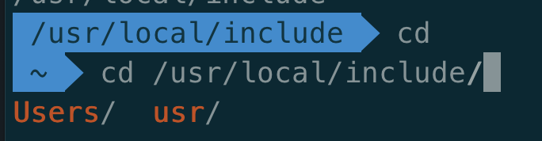

> ## 리눅스 파일명 규칙
- 최대 255자 까지 가능
- 알파벳 대소문자 숫자포함, 마침표, 밑줄, 하이픈
- **대/소문자** 구별
- 백슬래시(\)를 이용하여 특수 문자를 이스케이프
- 공백문자 포함시 인용부호 처리
- 숨김파일(디렉토리)명은 마침표(.)로 시작
   
 ***  

> ## 자동완성
- 쉽게 디렉토리 경로를 입력하고 이동하는 방법, Tab키를 이용하여 경로명/파일명에 대한 미리보기 및 자동완성 기능을 사용할 수 있다.


> ## 리눅스 디렉토리 구조
- 리눅스 최상위 디렉토리는 Root 디렉토리
    ```
    cd /
    ```
- bin : 많은 명령어들이 모여 있는 디렉토리 (기본명령어)
- sbin : 시스템 권한을 갖는 root 사용자가 사용하는 많은 명령어가 모여있는 디렉토리
- usr/bin : 리눅스 운영체제에 설치된 많은 응용프로그램이 위치하고 있는 디렉토리, 또한 명령어로 존재
- usr/local/bin : 응용프로그램이 usr/bin이 아닌 usr/local/bin을 선택하였을 때 설치프로그램이 위치
- lib : 기본 라이브러리 외에도 운영프로그램이 사용하는 많은 프로그램 라이브러리들이 존재
- usr/lib : 운영프로그램이 설치 될 당시에 실행가능한 프로그램 외에 사용하는 라이브러리들이 설치
- usr/local/lib : 운영프로그램이 설치 될 때 함께 설치한 라이브러리 경로
- dev : 장치파일이라고 불리우는 많은 파일이 존재, 이 파일들은 리눅스에 특수한 파일이라도 불리는 형태, 장치파일을 통해서 리눅스에 설치되어 있는 많은 하드웨어들을 작동, 응용프로그램들이 이 장치파일들을 이용하여 하드웨어에 접근
- etc : 환경파일이 모여있는 곳, 윈도우즈의 registry 개념과 동일, 응용프로그램들은 각자 자신이 사용하는 환경파일을 가지고 있음, 환경파일을 이용하여 응용프로그램 내부의 설정 및 시스템관련 정보를 추출함으로 알맞게 프로그램을 수행
- home : 많은 사용자들은 자신의 home 디렉토리를 가짐 (= 작업디렉토리라고 불림), 파일을 생성하거나 디렉토리를 생성하거나 소유권에 대한 걱정 없이 생성/수정이 가능
- var : 시스템에 관련된 많은 정보들을 저장하고 있는 디렉토리, 흔히 시스템로그라고 해서 시스템 내부의 동작상황을 모니터링하기 위한 로그파일을 얘기함
- var/log : 많은 로그파일들이 이 경로에 위치
- usr : 많은 리눅스 응용프로그램들이 설치, /usr/bin 경로에 binary 프로그램이 설치가 되며, 필요한 라이브러리 및 제반 시스템 헤더파일들 이런 것들은 include한 디렉토리에 두고 있으며, 프로그램 설치는 usr 기본 디렉토리 외에도 /usr/local에 설치 될 수 있음을 기억
  
> ## 경로변경 (절대경로와 상대경로)
- cd /usr/local/include (=절대경로, absolute PATH)
- cd ./include (=상대경로, relative PATH), ./ = 현재 디렉토리를 의미
  - cd ../ = 부모 디렉토리를 의미, ../../ 부모의 부모 디렉토리

> ## 파일의 접근권한


1. 파일의 종류
   1. d : 디렉토리
   2. f : 파일
   3. l : 심볼릭링크
   4. c/b : 장치파일
   5. p : 파이프
   6. \- : 일반파일
2. rwx (8진수 형태) - 소유자의 접근권한
   1. r : 읽기권한
   2. w : 쓰기권한
   3. x : 실행권한 (디렉토리의 경우, 열람가능)
3. rwx : 리눅스에서 그룹이라 불르는 사용자모임의 접근 권한
4. rwx : user와 group에 해당하지 않는 기타사용자들의 권한
5. 1 or n : 하드링크
   1. 1이란 숫자는 특정 목적의 파일을 가리키는 링크의 갯수가 1개라는 의미
   2. n이란 숫자의 의미는 현재 디렉토리에 하위 디렉토리의 갯수    (빈 디렉토리라 할 지라도, 2개의 하위 디렉토리를 가짐)
6. user : 소유자
7. user : 그룹
8. 4096 : 파일의 크기(바이트)
9. data : 파일의 경우 최종 수정시간, 디렉토리의 경우 최초 생성시간

> ## 심볼릭링크와 하드링크
- 리눅스에는 2가지 종류의 링크파일 형식이 존재

- 하드링크 생성
    ```
    // ex
    ln helloworld.txt helloworld.txt.hd
    ```
        

  - 파일 내용이 그대로이기때문에 파일명을 통해서 확인이 가능  
  - 하드링크 파일이 만들어 질 때마다 하드링크 수는 Update  
  (ex : helloworld.txt를 가르키는 링크의 수)  
  - 디렉토리를 하드링크를 만들 수 없음
  
- 심볼릭링크 생성
    ```
    // ex
    ln -s helloworld.txt helloworld.txt.sym
    ```
        

  - 윈도우즈의 바로가기 파일과 유사
