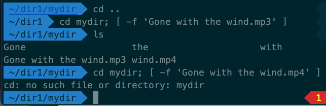
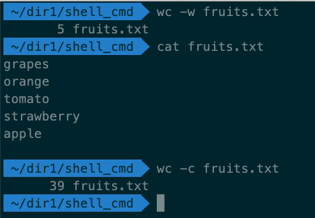
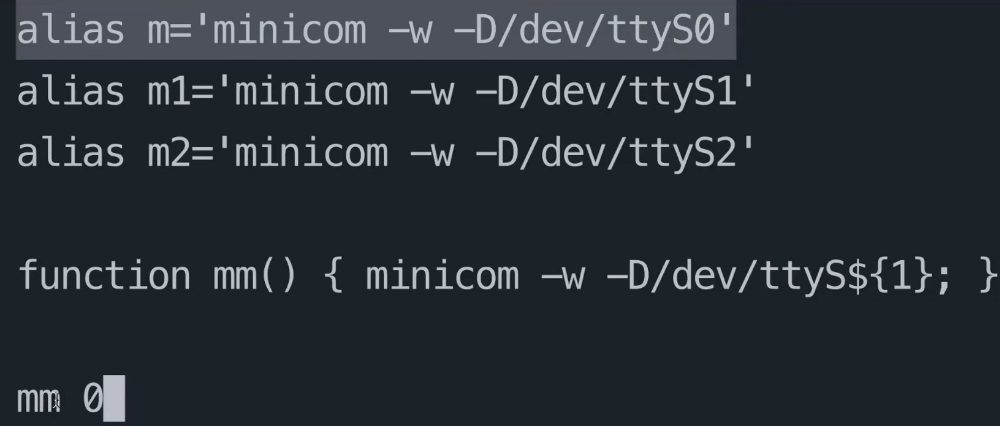
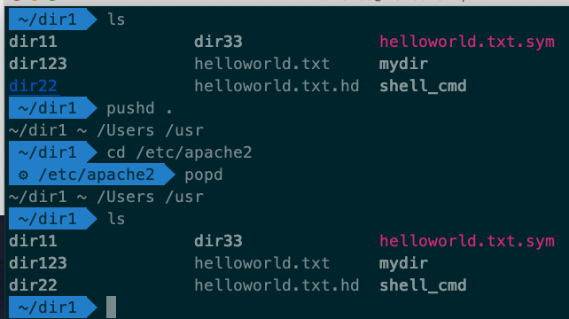
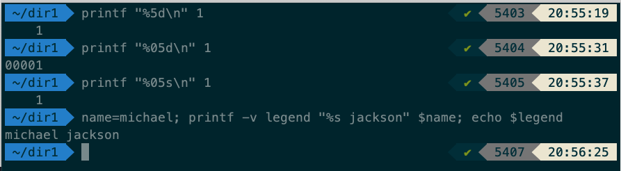
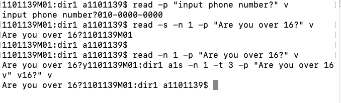
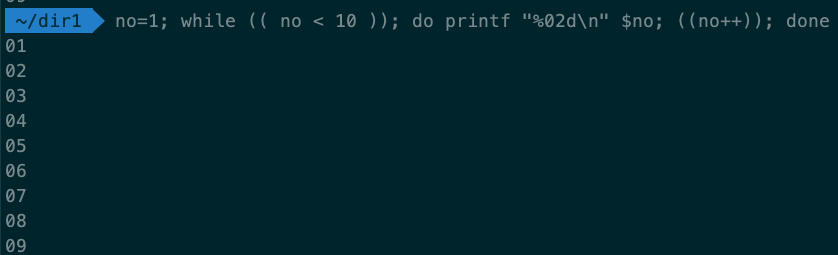
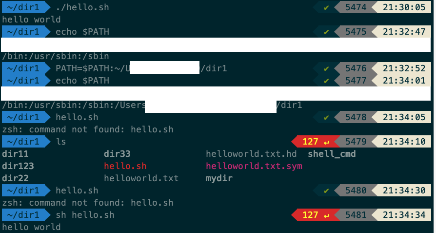

> ## echo의 사용법
- 리눅스 명령어 echo는 주어진 문자열을, 문자열 사이에 포함된 공백과 줄 마지막에 개행문자를 포함하여 표준출력으로 출력하는 명령어다.
- 화면 출력을 할 때 가장 많이 사용
- 필요 할 때는 인용부호를 꼭 써줘야한다
- 마지막으로 echo 명령은 화면 출력에만 사용하지 않고, 파일목록을 출력 할 때도 사용
   `
  
| 옵션 | 설명 |
|:---------------------|:---------------------|
| -n| 마지막에 따라오는 개행 문자(newline) 문자를 출력하지 않음 |
| -e| 문자열에서 역슬래시(\)와 조합되는 이스케이프 문자(escape sequence)를 인용부호(")로 묶어 인식 |

| 이스케이프문자 | 설명 |
|:---------------------|:---------------------|
| \a| 경고음 소리 출력|
| \b| 백스페이스|
| \c| 마지막 개행 문자를 출력 안 함|
| \f| 폼 피드 형식(프린터에서 용지 바꿈)으로 출력|
| \n| 개행 문자 출력|
| \r|개리지 리턴|
| \t| 수평 탭|
| \v|수직 탭|
| \\| 역슬래시|
| \nnn| ASCII Code가 nnn(8진수)인 문자|

> ## 명령어 구조
- 명령어는 옵션을 가지고 있을 수 있다.
- 옵션은 기본적으로 공백을 두고 `-{option}` 형태를 가지며, 전달인자 또한 가질 수 있다
  - `--{option}`처럼 두개의 -을 사용하는 명령어도 있다. (기능상의 차이점은 없다.)
   `

> ## [..]와 테스트
- [] 안에 명령어가 참/거짓 인지 확인
- 명령어와 옵션, 옵션과 전달인자 사이에 공백이 필요하므로 아래 이미지처럼 `[{공백} {옵션} {전달인자} {공백}]
`

> ## 명령어 (wc)
- wc는 파일의 단어와 글자의 수, 라인 수를 확인하는데 유용한 명령어
  `

> ## 명령어 (alias)
- 단축키처럼 명령어도 단축명령어라고 하는 것을 지원(=alias)
- alias는 전달인자(argument)을 넘겨 줄 수 없음. 함수(function)이 이에 대한 대안
- alias와 function을 구분하여 사용해야 함
- alias는 스크립트 내부에서 사용 못하는 단점이 있음, funtion은 가능
`

> ## 명령어 (pushd / popd)
- pushd : 특정경로를 stack에 저장함
- popd : stack에서 꺼내 저장한 경로로 이동
- `cd -` : cd명령어에 `-` option을 사용하여 바로 이전 경로는 pushd/popd 와 같은 용도로 사용 가능
   `

> ## 명령어 (printf)
- echo 명령과 달리 형식화된 출력이 가능
- printf와 echo는 쉘에서 즐겨 사용하는 출력 명령어
- printf를 이용하여 변수선언도 가능
  `

> ## 명령어 (read)
- echo, printf가 화면출력을 담당하는 명령어라고 한다면, read의 경우에는 사용자로부터 입력을 받음
| 옵션 | 설명 |
|:---------------------|:---------------------|
| -p| 특정 문구를 print |
| -n| 입력 문구 제한 (ex : Y/N과 같이 한 글자만 입력받아야 할 경우 `-n 1` |
| -s| 사용자가 입력한 문구를 출력하지 않는다. |
| -t| 사용자가 입력할 시간을 제한한다. |
`

> ## while..do..done
- 반복이 필요 할 때 사용
`

> ## 실행파일을 사용하는 4가지 방법
1. 기존 실행 파일들이 존재하는 경로(ex : /usr/bin)에 복사하여 사용하기
2. 실행파일의 전체 경로를 표현하기
3. 실행파일의 경로를 환경 변수에 추가하기
   1. `echo $PATH`를 이용하여 현재 PATH 확인
   2. PATH=$PATH~/{sh파일을 가지고 있는 디렉토리 전체 경로}
   `
4. ./{hello.sh} 상대경로로 실행
* alias로 설정하여 특정 단축명령으로 지정하여 사용도 가능할 것으로 생각됨
