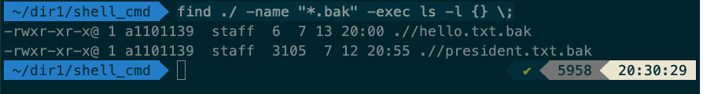
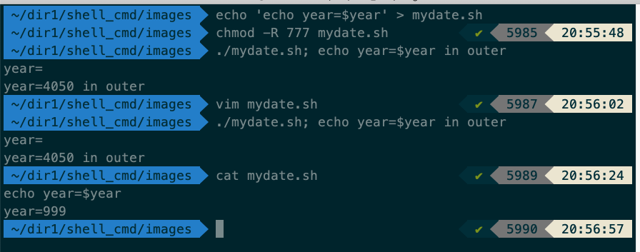
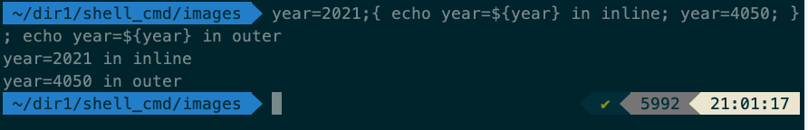

> ## 배열
- `declare -a 배열명=(요소1, 요소2, 요소3....)`
- 배열의 요소는 공백문자로 인해 분리되어야 함
- 배열은 실제 사용시 모든 배열을 표현하는 방법으로 `${!array[@]}`와 같이 사용
- 배열을 선언 할 때 `declare` 이용하여 선언하는 방법도 있지만, 생략하고 선언하는 방법도 있다. (ex : `ARRAY=("sky" "snow" "night"`)

> ## find와 -print0

- 지우려고 하는 파일은 파일명에 공백문자를 포함하는데, 따라서 정상적인 파일 삭제가 불가
- find 명령어에 `-print0` 옵션을 사용하면 문자열의 끝을 null 문자로 처리하여 파일의 끝을 분별 할 수 있음

[예제] - `-print0` 옵션을 사용 여부 차이

> ## 명령어 find
- find 명렁어의 다양한 활용 예
  - maxdepth option : `find ./ -maxdepth 1 -iname '*.sh'`
    
    - 숨김파일 찾기
    

  - exec option : `find ./ -name "*.bak" -exec ls -l {} \;`
    - `\;` 로 명령어의 종료를 나타내주어야 함
    
  - type option : `find ./ -type d` (폴더만 검색)
    

> ## 입력과 출력 (Input and Output)
- Bash 스크립트의 입력 및 출력은 복잡한 주제
- Bash 스크립트 입력은 아래처럼 다양한 방법 가능
  - 명령 줄 인수
  - 환경 변수
  - 파일
  - 파일 기술자로 표현 가능한 파이프, 터미널, 소켓 등
- Bash 스크립트의 출력은 아래처럼 다양한 형식이 가능
  - 파일
  - 파일 디스크립터로 표현 간으한 다른 것
  - 다른 프로그램에 명령 줄 인수로 넘길 수 있음
  - 혹은 다른 프로글매에 환경 변수의 형태로 넘길 수 있음

> ## 위치 매개 변수
- 전달인자를 넘겨 받을 때 사용하는 `$1, $2, $3 ... ${10}, ${11}` 을 위치매개변수라고 함

> ## 변수의 범위(스코프)
- 쉘 변수는 기본적으로 전역변수
- 함수 안에서 선언한 변수는 함수 밖에도 영향을 미침

- 스크립트 파일 밖에서 선언한 변수는 스크립트 파일 안에서 유효하지 않음
- 스크랩트 파일 안에서 선언한 변수는 밖에서 유효하지 않음

- 서브쉘 바깥에서 선언된 변수가 서브쉘 내에서 접근 가능
- 서브쉘 내에서 변경된 값은 서브쉘 안에서만 유효
  - 서브쉘은 기본적으로 변수를 복제하여 사용하는 특성을 가짐

- 인라인 그룹 안에서 변경 된 내부 변수는 실제로 {} 인라인 그룹을 벗어나고도 유효
  - 인라인그룹은 기본적으로 명령어를 묶어놓는 것 뿐

- export(=환경변수) 한 변수를 스크립트 내부와 스크립트를 벗어난 변수에도 영향을 미침

Tip. 변수의 범위를 아는 것은 나름대로 의미가 있다. 커맨드 라인 상에서 입력하는 변수, 스크립트에서 사용하는 변수, 함수에서 사용하는 변수, child process에서 사용하는 변수의 유효범위를 알고 있다면, 작성하는 스크립트의 오류를 예방하고 실수를 막을 수 있다.

> ## 파일디스크립터 (FD)
- 프로그램이 파일을 참조하는 방식이거나, 파일(파이프, 장치, 소켓 또는 터미널)처럼 작동하는 다른 리소스를 참조하는 방법
- FD는 데이터 소스에 대한 포인터와 비슷하건, 혹은 기록 가능한 장소 같은 것
- FD에서 읽거나 쓸 때 FD의 리소스에서 데이터를 읽거나 쓰게 된다.
- 기본적으로 모든 프로세스는 3가지의 열린 파일디스크립터를 가짐
  - 표준 입력(stdin) : 파일디스크립터 0
  - 표준 출력(stdout) : 파일디스크립터 1
  - 표준 오류(stderr) : 파일디스크립터 2

> ## 리다이렉션
- 표준 출력내용을 파일로 저장하거나, 파일의 내용을 다른 파일로 넘긴다거나 하는 redirection이라는 문법이 존재
- 리다이렉션 연산자
  - `>` : 해당 파일이 없다면, 신규로 생성 있다면 새로운 내용으로 덧씀
  - `>>` : 내용을 append
[예제]
- `>` 을 이용하여 2가지 파일을 병합

- `<` 표준입력을 이용한 file read
- `<` 표준입력을 이용한 file read

