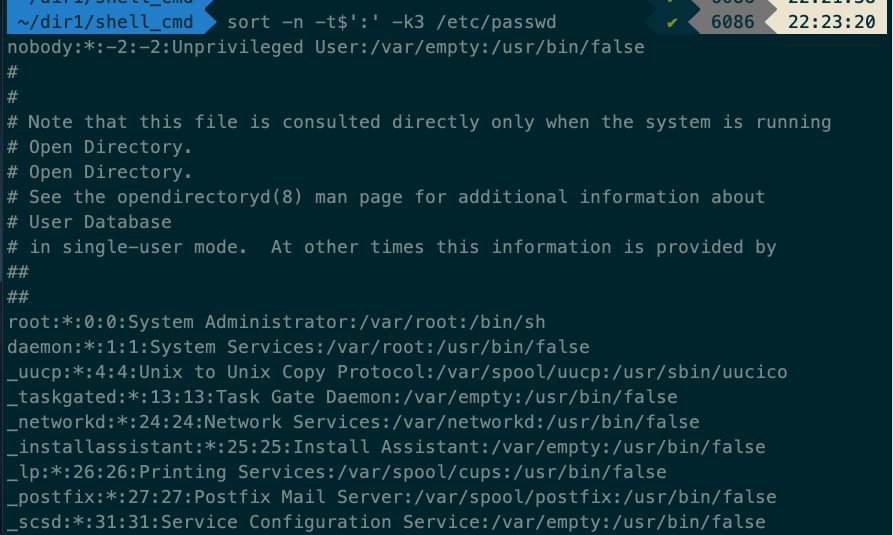

> ## 명령어 (nohup)
- `date;nohup ./mydaemon.sh 1>/dev/null 2>&1 0</dev/null &`
- `1>/dev/null` : 표준 출력은 휴지통으로 들어감
- `2>&1` : 표준 오류는 표준 출력으로 제어됨
- `0</dev/null` : 표준 입력을 차단 
- `&` : 백그라운드 프로세스화

- 설명 : date 명령어를 이용하여 .sh(1초에 한번씩 현재 날짜를.log 파일 남기는 파일)가 실행되기 전 날짜를 찍고 백그라운드로 실행 한 이후 다른 터미널을 실행하여 계속 로그가 찍히는 걸 확인하는 예제

> ## 명령어 (tee)
- 사용 예 : 표준출력/표준에러 출력을 보면서 동시에 로그파일을 남기고 싶을 경우
- `echo "Jurassic World" | tee steven.txt #overwrite` : "Jurassic World"를 print하고 해당 문자열을 steven.txt에 덮어써라.
- `echo "Jurassic World" | tee -a steven.txt #append` : "Jurassic World"를 print하고 해당 문자열을 steven.txt에 추가해라.
- `grep -i "Star Wars" steven.txt lucas.txt 2>&1 | tee george.t
xt #error` : 표준 오류 또한 로그로 나오게 할 수 있다. 에러메시지가 표준 오류장치로 나오지 않고 표준 출력 장치로 나오는 것은 `2>&1 (redirect의 결과)` 

> ## 명령어 (HEREDOC)
- `<<` : HEREDOC 연산자
- 공백문자나 탭문자가 있으면 안됨, 관행적으로 대문자를 이용하여 `HERE` 를 사용하나 다른글자도 무방
- 'HERE' vs HERE : ''(=인용부호)가 사용된 HEREDOC 문서는 내부에 사용된 변수 즉 환경변수를 확장이 일어난 시점을 다르게 처리, ''가 사용된 HEREDOC 이 확장이 실제로 명령이 실행 된 이후로 넘김

- 입력할 문자열이 많은 것을 화면에 표시하고 싶을 때 HEREDOC을 이용가능하며, script 파일을 작성할 때 유용, 위 예제 참고

> ## 명령어 (HERESTRING)
- `<<<` : HERESTRING 연산자
- 특징은 anchor가 없는 것이 HEREDOC과 차이, anchor 대신 문자을 형식을 사용해서 인용부호를 사용해서 파일형식으로 전달

> ## 명령어 (uniq)
- 텍스트 파일 내에 중복된 내용의 행이 연속으로 있으면 중복 없이 하나의 행으로 만들어 주는 명령어
- `uniq -c fruits_multi.txt` : 반복이 몇 번 일어났는지 출력
- `uniq -d fruits_multi.txt` : 반복이 된 행반 출력

> ## 명령어 (sort)
- 파일 내 행을 정렬(=기본 오름차순)
- `sort -r fruits.txt` : 내림차순으로 정렬

- `sort -n -t$':' -k2 /etc/passwd` : -k 옵션을 이용하여 소트 대상 필드를 선택 할 수 있다.
